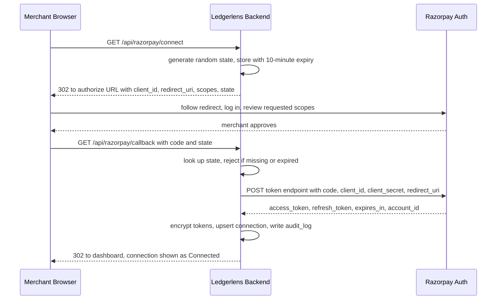
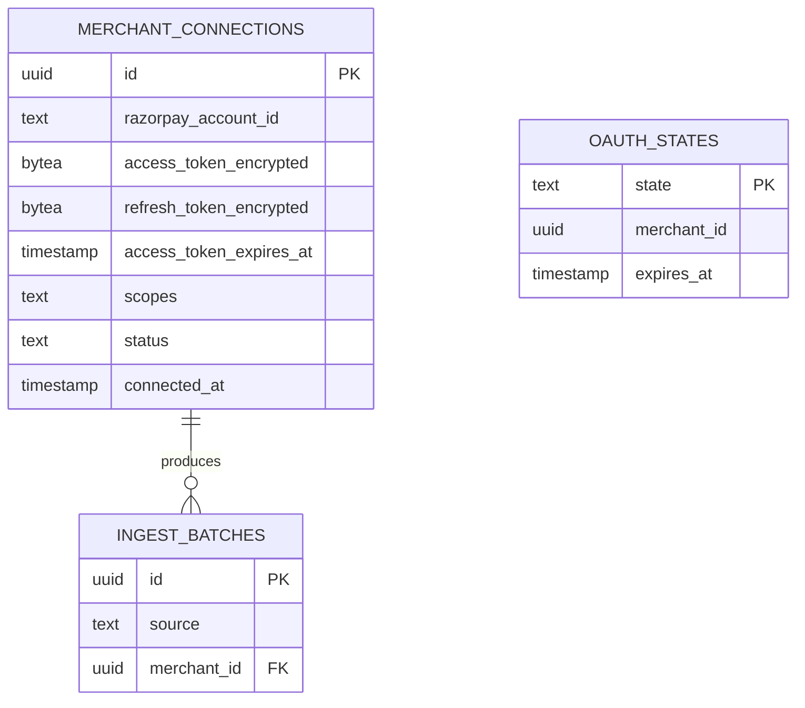
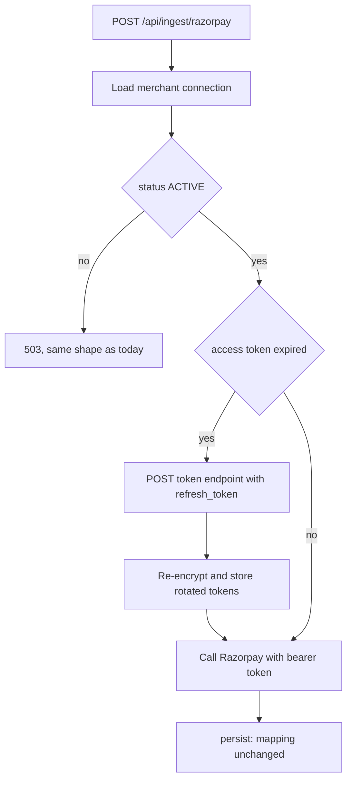

# Razorpay OAuth connect — design

> **Designed, not implemented.** Nothing in section 4 exists in this repository. Section 3 is the
> only part describing code that runs today.

| | |
|---|---|
| **Today** | One Razorpay account. Credentials come from env vars, fixed at deploy time. |
| **Needed** | Each merchant connects their own account, read-only. |
| **Blocked by** | A `client_id` from Razorpay's Partner Dashboard, and a public HTTPS callback URL. |
| **Effort** | ~1 day once both exist. Additive — nothing downstream of ingestion changes. |

## 1. The problem

Credentials are read from `RAZORPAY_KEY_ID` and `RAZORPAY_KEY_SECRET` at startup, in
`backend/src/main/java/com/ledgerlens/service/RazorpayIngestService.java`. They are fixed at deploy
time, so one deployment can only ever read one account.

The obvious fix — ask each merchant for their key — is not an option:

> **A Razorpay key secret is account-wide, not read-only.** There is no read-only variant to hand
> out. Asking a merchant for it means asking for full API access to their payments account in
> exchange for a reconciliation report — and it leaves the operator holding a database of other
> people's account-wide secrets.

OAuth fixes exactly that. The merchant approves named read-only scopes on Razorpay's own domain.
Ledgerlens receives a token that can list payments and settlements and nothing else. No secret moves,
and the merchant can revoke it.

## 2. Why it is not built here

| Blocker | Detail |
|---|---|
| No `client_id` | Issued by registering an app on the Razorpay Partner Dashboard — an approval on someone else's timeline. Without it there is no authorize URL and no token endpoint. |
| No public callback | `redirect_uri` must be publicly resolvable. This runs on localhost via `docker-compose.yml`. A tunnel would prove the mechanics, not the configuration that would ship. |
| Tokens are all-or-nothing | Encryption at rest, refresh under concurrency, revocation. Half-built token handling looks finished and isn't — worse than a design a reviewer can judge. |
| One unverified dependency | `com.razorpay:razorpay-java:1.4.9` (`backend/pom.xml`) builds its client from key + secret. Whether it accepts a bearer token is unchecked. Changes code volume, not the design. |

**Estimate once unblocked: ~1 day** — credentials interface, two tables, two endpoints, encryption,
refresh, audit entries.

## 3. What exists today

**Runs now:**

- **Read-only fetch** — `RazorpayIngestService` calls `payments.fetchAll`, `refunds.fetchAll` and the
  settlement recon report. No create or write call anywhere in it.
- **Endpoint** — `POST /api/ingest/razorpay` in
  `backend/src/main/java/com/ledgerlens/controller/IngestController.java`.
- **Clean refusal** — `configured()` is `!keyId.isBlank() && !keySecret.isBlank()`; `ingest(...)`
  throws 503 naming both variables and pointing at `POST /api/ingest/csv`. Reversed dates give 400, a
  `RazorpayException` gives 502.
- **Fetch separated from mapping** — `persist(payments, refunds, reconLines)` takes parsed JSON and
  does not know how it was obtained. This is what makes OAuth additive.
- **Append-only audit log** — `audit_log` and `trg_audit_log_append_only` in
  `backend/src/main/resources/schema.sql`.

**Does not exist** (the design below adds it):

- No credentials abstraction — `RazorpayIngestService` takes the key and secret as `@Value`
  constructor parameters and builds `new RazorpayClient(keyId, keySecret)` inline.
- No webhook endpoint, no signature verification.
- No notion of a merchant. No table has a `merchant_id`.

The seam has to be cut, not filled. It is a small cut — one interface, one constructor change —
because `persist(...)` is already isolated.

## 4. The design

### 4a. Connect flow



Scopes are read-only: enough to list payments, refunds and settlement reports, nothing that moves
money.

### 4b. Data model

Two new tables. Existing `ingest_batches` gains a nullable `merchant_id` — CSV batches leave it null,
so every current row and test stays valid.



`status` is `ACTIVE`, `EXPIRED` or `REVOKED`. Tokens exist only as ciphertext.

### 4c. Runtime fetch



New class `OAuthRazorpayCredentialsProvider`, implementing the interface extracted in the same
change. Illustrative only — does not compile, not in the repo:

```java
final class OAuthRazorpayCredentialsProvider implements RazorpayCredentialsProvider {
    @Override
    public RazorpayClient clientFor(UUID merchantId) {
        MerchantConnection connection = connections.requireActive(merchantId);
        String token = connection.accessTokenExpired()
                ? refreshAndStore(connection)
                : cipher.decrypt(connection.accessTokenEncrypted());
        return razorpayClients.withAccessToken(token);
    }
}
```

The last line is the unverified dependency from section 2, not a settled detail.

### 4d. Security

- AES-GCM at rest, key from an env var, never committed.
- Tokens never logged, never in an exception message, never returned by an endpoint.
- `oauth_states` expire after 10 minutes; an unknown or expired `state` is rejected. This is what
  stops a forged callback attaching someone else's account.
- Disconnect deletes the merchant's webhook and marks the connection `REVOKED` — the row survives.
- Every connect, refresh, disconnect and failure written to `audit_log`.

## 5. What it unlocks

- Merchants onboard themselves; no operator holds their credentials.
- Each connection registers its own webhook — ingestion becomes event-driven instead of a date-range
  pull.
- Everything after `persist(...)` is unchanged: matching, exceptions, waterfall, forecast, statement.

## 6. Out of scope: the bank side

OAuth scope cannot reach it, for a structural reason:

> Razorpay knows what it **sent**. Only the bank knows what **arrived**. The difference between those
> two claims is the entire product.

So a Razorpay-only integration, however well authorised, can never close the reconciliation alone.
Automating the bank side means India's Account Aggregator framework — separate registrations, consent
artefacts and operators, sharing nothing with the design above. Deliberately not designed here. Until
it exists, the bank statement arrives as a file via `POST /api/ingest/csv`, which is why the CSV path
is the primary one and not a fallback.
