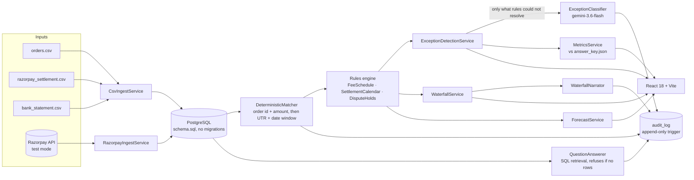

# ledgerlens

Explains every rupee between what you sold and what hit your bank.

An AI Finance Controller for Indian merchants on Razorpay. Give it three files — the order export,
the Razorpay settlement report, the bank statement — and it:

- explains the gap between sales and money received, as a waterfall that closes to the rupee
- lists what it could not match as typed exceptions, each with a reason and a confidence
- forecasts what is still due to land, and on which day
- answers plain questions from the rows themselves, citing the ones it used

---

## Measured results

Everything below is produced by the test suite on the committed 300-order batch
(`data/`, seed 42), not by hand. Reproduce with `mvn test` in `backend/`.

### Matching

| metric | value |
| --- | --- |
| Orders in batch | 300 |
| Orders matched to a settlement line | 276 |
| **Match rate** | **92.00%** |
| Clean-record share (the floor it must beat) | 88.00% |
| Settlements matched to a bank credit | 21 of 24 |
| Bank credits left unclaimed | 3 |

The 8% gap is entirely the 15 failed payments and 9 dispute-held payments, which are legitimately
absent from the settlement report. No rule invents a match for them.

### Exception detection

Scored against `answer_key.json`, joined on entity reference — an order id for order-level findings,
a UTR for bank-level ones — so a finding of the right type against the wrong record would cost both
precision and recall.

| status | injected | detected | precision | recall | F1 |
| --- | --- | --- | --- | --- | --- |
| PAYMENT_FAILED | 15 | 15 | 1.0000 | 1.0000 | 1.0000 |
| HELD_DISPUTE | 9 | 9 | 1.0000 | 1.0000 | 1.0000 |
| REFUND_PRIOR_CYCLE | 17 | 17 | 1.0000 | 1.0000 | 1.0000 |
| BANK_MISSING | 3 | 3 | 1.0000 | 1.0000 | 1.0000 |
| BANK_DUPLICATE | 3 | 3 | 1.0000 | 1.0000 | 1.0000 |
| AMOUNT_MISMATCH | 3 | 3 | 1.0000 | 1.0000 | 1.0000 |
| UNKNOWN | 0 | 0 | — | — | — |
| **overall** | **50** | **50** | **1.0000** | **1.0000** | **1.0000** |

**Read these as a statement about the data, not about reconciliation being solved.** Every anomaly
this generator injects is directly observable in the three files, so a correct rule finds all of
them. The number actually worth watching is UNKNOWN at zero: nothing in the batch was left
unexplained or quietly absorbed. See [What it gets wrong](#what-it-gets-wrong).

### Calibration

| confidence bucket | findings | mean confidence | observed accuracy |
| --- | --- | --- | --- |
| 0.70 – 0.90 | 5 | 0.8500 | 1.0000 |
| 0.90 – 1.00 | 45 | 0.9900 | 1.0000 |

The detector is **under-confident**, not over-confident: the five pre-window refunds are stamped
0.85 and all five are right. That is the safer direction to be wrong in, and it is left uncorrected
rather than tuned to look better.

### Waterfall and forecast

The waterfall closes **exactly**, asserted with `isEqualByComparingTo` against the ingested bank
statement rather than a tolerance:

```
  Gross sales                        1,554,691.47
− Failed payments                       86,606.98
− Razorpay fees                         13,967.30
− GST on fees                            2,514.12
− Held for disputes                     48,069.24
− Refunds                               76,027.33
                                  ───────────────
  Settled by Razorpay                1,327,506.50
− Settlements not credited by bank     108,557.71
+ Unmatched bank credits               226,173.90
+ Bank amount differences                   33.00
                                  ───────────────
  Bank credits                       1,445,155.69   ✓ to the rupee
```

The forecast reproduces all three injected dispute-release dates exactly — 2026-09-02 ₹608.29
WALLET, 2026-09-03 ₹4,104.75 UPI, 2026-09-04 ₹5,816.99 UPI — including the per-method split.

### Suite

151 backend tests, 0 failures. Testcontainers starts a real PostgreSQL 16, so Docker must be running.

---

## Architecture



**Rules first, model second.** Deterministic rules settle everything they can. The model never
computes a number — it classifies only what the rules could not, narrates a waterfall that was
already computed, and answers from rows already retrieved.

**Every model call is logged** to `audit_log` with the prompt hash, model, latency and output.

**Package layout** is layered Spring: `entity`, `repository`, `service`, `controller`, `dto`, plus
`rules` for the domain arithmetic and `runner` for the generator CLI. Dependencies point inward —
nothing in `entity` or `repository` imports from `dto` or `controller`.

---

## Hybrid Q&A retrieval

The Ask panel routes each question before answering it. A plain heuristic, no model call:

| the question | path | why |
| --- | --- | --- |
| names an order id, UTR, amount or date | SQL only | there is something exact to look up; similarity would add noise |
| asks what a term means | glossary | "what is a chargeback" has no answer in anyone's rows |
| anything else | SQL, then vectors | "why did we receive less money" has no anchor to look up |

Reconcile indexes two kinds of document into `rag_documents`: one per exception, one per matched
order. No raw bank rows and no settlement lines — they carry no sentence a question could match.

**Batch isolation is the invariant.** Every search takes the batch as a required argument, filters on
the `batch_id` column in SQL, and then re-checks each hit's batch against its metadata before it is
used. One merchant's rows reaching another's answer is the failure this feature must not have, so it
is guarded twice. `RagTest.aQuestionAboutOneBatchNeverReachesAnother` seeds a document that would
match perfectly into batch A and asserts that asking batch B returns nothing belonging to A;
`aHitClaimingAnotherBatchIsDiscarded` proves the second guard catches what a filtering bug would
produce.

Indexing runs at the end of reconcile and cannot fail it — errors are logged and swallowed, and
`RagTest$Indexer.indexingFailureDoesNotFailReconcile` holds that line.

**To disable:** `ledgerlens.rag.enabled=false` (or `LEDGERLENS_RAG_ENABLED=false`). Nothing is
indexed, no search happens, and Ask behaves exactly as it did before vectors existed —
`RagDisabledTest` asserts all three. Requires the `pgvector/pgvector:pg16` image, which
`docker-compose.yml` and the Testcontainers tests both use.

---

## Designed, not shipped

**[Razorpay OAuth connect](OAUTH-DESIGN.md)** — today Ledgerlens reads one Razorpay account, because
credentials come from env vars. Merchants cannot just hand over their API key instead: a Razorpay key
secret is account-wide, not read-only. The design covers the OAuth flow that fixes this, and why it
is not built here — it needs partner credentials from Razorpay and a public HTTPS callback URL.

---

## Setup

### Everything at once

```bash
cp .env.example .env      # then set POSTGRES_PASSWORD
docker compose up --build
```

Backend on `:8080`, frontend on `:5173`, Postgres on `:5432`. Both API keys are optional — see
[Running without keys](#running-without-keys).

### Backend on its own

```bash
docker compose up -d postgres
cd backend && cp src/main/resources/application-example.yml src/main/resources/application.yml
set -a && source ../.env && set +a      # POSTGRES_PASSWORD has no default
mvn spring-boot:run
```

### Frontend on its own

```bash
cd frontend && npm install && npm run dev
```

`/api` is proxied to `localhost:8080`, and the committed batch in `data/` is served at `/sample/*`
so the Upload screen's **Load sample data** works without copying files around.

### Regenerating the synthetic batch

```bash
cd backend && mvn spring-boot:run -Dspring-boot.run.arguments="--spring.profiles.active=generate --count=300 --seed=42 --out=../data/"
```

Deterministic by seed: the same seed produces byte-identical files, which a test asserts. Larger
runs belong in `data/large/`, which is gitignored.

### Tests

```bash
cd backend && mvn test
```

Needs Docker running — Testcontainers starts a real PostgreSQL 16. No API key is needed; the AI
layer is driven by a stubbed chat model.

### Environment

Every value the app reads comes from the environment; nothing is hardcoded. Copy `.env.example` to
`.env` and fill it in — `.env` is gitignored, `.env.example` never holds a real value.

| variable | required | needed for | without it |
| --- | --- | --- | --- |
| `POSTGRES_PASSWORD` | **yes** | the database | compose refuses to start and the backend fails to connect. There is no fallback on purpose |
| `POSTGRES_DB` | no | database name | defaults to `ledgerlens` |
| `POSTGRES_USER` | no | database user | defaults to `ledgerlens` |
| `POSTGRES_HOST` / `POSTGRES_PORT` | no | pointing at a database compose did not start | default to `localhost:5432`; compose sets them itself |
| `GEMINI_API_KEY` | no | classifier, narrator, Ask | those three endpoints return 503; everything else works |
| `GEMINI_MODEL` | no | choosing a different model | defaults to `gemini-3.6-flash` |
| `RAZORPAY_KEY_ID` / `RAZORPAY_KEY_SECRET` | no | `POST /api/ingest/razorpay` | that endpoint returns 503 naming the missing variables; CSV ingest is unaffected |
| `LEDGERLENS_MERCHANT_NAME` | no | the name at the head of the PDF statement | defaults to `Your business`; there is no merchant record in the schema |
| `LEDGERLENS_ANSWER_KEY_PATH` | no | scoring `/api/metrics` against ground truth | defaults to `data/answer_key.json`; compose mounts `./data` read-only at `/app/data` |
| `BACKEND_PORT` / `FRONTEND_PORT` | no | avoiding a port clash | default to `8080` and `5173` |

#### Running without keys

The app starts and reconciles fully with neither API key set. CSV ingest, matching, the waterfall,
the exception list, the metrics and the forecast are all deterministic and need no model.

---

## API

| method | path | returns |
| --- | --- | --- |
| POST | `/api/ingest/csv` | batch id and per-table row counts |
| POST | `/api/ingest/razorpay` | same, pulled from the test-mode API |
| POST | `/api/reconcile/{batchId}` | runs matcher, rules and exception detection; returns the summary |
| GET | `/api/reconcile/{batchId}/summary` | match rate, counts by status, totals |
| GET | `/api/reconcile/{batchId}/waterfall` | ordered signed steps with source row ids |
| GET | `/api/reconcile/{batchId}/narrative` | plain-English narration of the waterfall |
| GET | `/api/reconcile/{batchId}/exceptions` | status, reason, confidence, source row ids |
| GET | `/api/reconcile/{batchId}/matches` | paginated matched rows |
| GET | `/api/forecast/{batchId}` | forward settlement calendar |
| GET | `/api/reconcile/{batchId}/statement.pdf` | two-page settlement statement as a PDF |
| POST | `/api/ask/{batchId}` | `{answer, citedRowIds[], citations[]}` — citations name the row, not its id |
| GET | `/api/health/{batchId}` | batch metrics, baseline and anomaly alerts |
| GET | `/api/health/{batchId}/history` | the trailing batches the baseline is drawn from |
| GET | `/api/metrics/{batchId}` | precision/recall per status plus calibration buckets |

---

## What it gets wrong

Honest failure cases from the 300-order run and the design choices behind them.

**Perfect precision and recall are a property of the synthetic data.** Every injected anomaly is
directly observable in the three files. A real batch would contain ambiguity this one does not, and
the scores would drop. Do not read 1.0000 as "solved".

**HELD_DISPUTE is read from a column, not inferred.** The CSV contract is three files with no
disputes export, so `orders.csv` carries `dispute_status` and `dispute_opened_at`. Detection is
therefore trivially correct and its 1.0000 recall means very little. A real merchant would need a
fourth file or the API path, and the API path does not fetch disputes at all.

**The classifier never runs on the committed batch.** The rules leave zero UNKNOWNs, so the model is
not invoked once. That is the architecture working as intended, but it means the classifier's
accuracy is untested against real ambiguity — it is only exercised by a hand-built batch in
`AiLayerTest` containing an unplaceable bank credit.

**The generator constrains where anomalies can land.** Disputes are only opened on orders from the
last 10 days of the window, so every disputed payment is still held at the cutoff; refunded orders
come only from the first 21 days, so each refund reliably lands in a later cycle. Mid-window dispute
resolution is not modelled at all, and a real batch would contain it.

**Bank UTR recovery is deliberately conservative.** A UTR split across separators in the narration
(`utr-2026 072801`) is *not* reassembled — gluing free-text tokens together is how a reconciler
produces a confident wrong match. Such a row falls through to the amount-and-date check instead, and
if that fails it is reported as unmatched rather than guessed.

**The Razorpay path cannot complete a reconciliation.** Razorpay cannot see the merchant's bank
account, so no bank rows are created and every settlement will look uncredited until a statement is
supplied separately.

**Unmatched bank credits are labelled BANK_DUPLICATE only when a UTR twin exists.** Anything else
becomes UNKNOWN at 0.30 confidence. On a messier statement that bucket would be much larger.

**Public holidays are ignored.** The settlement calendar skips Saturdays and Sundays only, so any
batch spanning an Indian bank holiday will predict settlement dates a day or more early.

**Desktop only.** The UI is built for ≥1280px and has no mobile layout.
