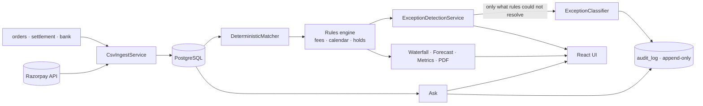

# ledgerlens

Explains every rupee between what you sold and what hit your bank.

An AI Finance Controller for Indian merchants on Razorpay. Give it three files — the order export,
the Razorpay settlement report, the bank statement — and it:

- **explains the gap** between sales and money received, as a waterfall that closes to the rupee
- **lists what it could not match** as typed exceptions, each with a reason and a confidence
- **forecasts** what is still due to land, and on which day
- **answers plain questions** from the rows themselves, citing the ones it used

**[Live demo](https://ledgerlens-w0dk.onrender.com/)** — click **Load sample data**, then **Reconcile**.

Hosted free, so the instance sleeps when idle: the first load takes 30–60 seconds to wake, and the
first question after a reconcile waits on the index being built. The Gemini key behind it is a
free-tier one too — if the Ask panel and the **What happened** narration stop answering, that quota
has run out and will reset on its own. Nothing else is affected: the reconciliation, the waterfall,
the exceptions and the forecast are deterministic and need no model at all.

---

## Quick start

```bash
cp .env.example .env      # then set POSTGRES_PASSWORD
docker compose up --build
```

Open `http://localhost:5173`, click **Load sample data**, then **Reconcile**. Both API keys are
optional — see [Running without keys](#running-without-keys).

The UI walks one path: **Landing → Upload → Reconciliation → Waterfall → Forecast**, with the Ask
panel available from every screen after a batch exists.

---

## Results

Produced by the test suite on the committed 300-order batch (`data/`, seed 42), not by hand.

### Matching

| metric | value |
| --- | --- |
| Orders in batch | 300 |
| Orders matched to a settlement line | 276 |
| **Match rate** | **92.00%** |
| Clean-record share (the floor it must beat) | 88.00% |
| Settlements matched to a bank credit | 21 of 24 |
| Bank credits left unclaimed | 3 |

The 8% gap is entirely the 15 failed payments and 9 dispute-held payments, which are legitimately
absent from the settlement report. No rule invents a match for them.

### Exception detection

Scored against `answer_key.json`, joined on entity reference — an order id for order-level findings,
a UTR for bank-level ones — so a finding of the right type against the wrong record costs both
precision and recall.

| status | injected | detected | precision | recall | F1 |
| --- | --- | --- | --- | --- | --- |
| PAYMENT_FAILED | 15 | 15 | 1.0000 | 1.0000 | 1.0000 |
| HELD_DISPUTE | 9 | 9 | 1.0000 | 1.0000 | 1.0000 |
| REFUND_PRIOR_CYCLE | 17 | 17 | 1.0000 | 1.0000 | 1.0000 |
| BANK_MISSING | 3 | 3 | 1.0000 | 1.0000 | 1.0000 |
| BANK_DUPLICATE | 3 | 3 | 1.0000 | 1.0000 | 1.0000 |
| AMOUNT_MISMATCH | 3 | 3 | 1.0000 | 1.0000 | 1.0000 |
| **overall** | **50** | **50** | **1.0000** | **1.0000** | **1.0000** |

**Read this as a statement about the data, not about reconciliation being solved.** Every anomaly
the generator injects is directly observable in the three files, so a correct rule finds all of
them. The number actually worth watching is **UNKNOWN at zero**: nothing was left unexplained or
quietly absorbed. See [Limitations](#limitations).

### Calibration

| confidence bucket | findings | mean confidence | observed accuracy |
| --- | --- | --- | --- |
| 0.70 – 0.90 | 5 | 0.8500 | 1.0000 |
| 0.90 – 1.00 | 45 | 0.9900 | 1.0000 |

The detector is **under-confident**, not over-confident: the five pre-window refunds are stamped
0.85 and all five are right. That is the safer direction to be wrong in, and it is left uncorrected
rather than tuned to look better.

### Waterfall

Closes **exactly** — asserted with `isEqualByComparingTo` against the ingested bank statement, not a
tolerance:

```
  Gross sales                        1,554,691.47
− Failed payments                       86,606.98
− Razorpay fees                         13,967.30
− GST on fees                            2,514.12
− Held for disputes                     48,069.24
− Refunds                               76,027.33
                                  ───────────────
  Settled by Razorpay                1,327,506.50
− Settlements not credited by bank     108,557.71
+ Unmatched bank credits               226,173.90
+ Bank amount differences                   33.00
                                  ───────────────
  Bank credits                       1,445,155.69   ✓ to the rupee
```

The forecast reproduces all three injected dispute-release dates exactly — 2026-09-02 ₹608.29
WALLET, 2026-09-03 ₹4,104.75 UPI, 2026-09-04 ₹5,816.99 UPI — including the per-method split.

---

## How it works



**Rules first, model second.** Deterministic rules settle everything they can. The model never
computes a number — it classifies only what the rules could not, narrates a waterfall that was
already computed, and answers from rows already retrieved.

**Every model call is logged** to `audit_log` with the prompt hash, model, latency and output. A
trigger in `schema.sql` blocks `UPDATE` and `DELETE` on that table.

### The Ask panel

Each question is routed before it is answered, by a plain heuristic — no model call:

| the question | path | why |
| --- | --- | --- |
| names an order id, UTR, amount or date | SQL only | there is something exact to look up |
| asks what a term means | glossary | "what is a chargeback" has no answer in anyone's rows |
| anything else | SQL, then vectors | "why did we receive less money" has no anchor |

For the vector path, reconcile writes one sentence per exception and one per matched order into
`rag_documents`, on a background thread once the transaction commits — nobody waits on the
embedding provider. Exceptions go in first, matches fill what is left of the budget
(`ledgerlens.rag.max-documents`, default 90, which keeps a reconcile inside Gemini's free tier).

**Batch isolation is the invariant.** Every search takes the batch as a required argument, filters
on `batch_id` in SQL, then re-checks each hit's metadata before using it — one merchant's rows
reaching another's answer is the failure this must not have, so it is guarded twice and `RagTest`
asserts both. `LEDGERLENS_RAG_ENABLED=false` turns the whole path off; `RagDisabledTest` asserts
Ask then behaves exactly as it did before vectors existed.

---

## Project structure

```
.
├── backend/                       Java 21 · Spring Boot 3.5 · Maven
│   └── src/
│       ├── main/java/com/ledgerlens/
│       │   ├── controller/        7 REST controllers, one per API area
│       │   ├── service/           ingest · matching · waterfall · forecast · metrics · AI · RAG
│       │   ├── rules/             FeeSchedule · SettlementCalendar · DisputeHolds · StatusGlossary
│       │   ├── entity/            JPA entities and enums, 1:1 with schema.sql
│       │   ├── repository/        Spring Data interfaces
│       │   ├── dto/               API request and response records
│       │   └── runner/            GenerateRunner — the synthetic-batch CLI
│       ├── main/resources/
│       │   ├── schema.sql         14 tables, hand-written; no Flyway, ddl-auto=validate
│       │   └── application-example.yml
│       └── test/java/             21 test classes, on a real Postgres via Testcontainers
├── frontend/                      React 18 · Vite · TypeScript · Tailwind
│   └── src/
│       ├── screens/               Landing → Upload → Reconciliation → Waterfall → Forecast
│       ├── components/            AskPanel · HealthStrip · Drawer · StatusStrip · …
│       ├── api/client.ts          one typed fetch wrapper
│       └── lib/                   formatting, motion presets, narration
├── data/                          the committed 300-order batch + answer_key.json
├── docker-compose.yml             postgres (pgvector) · backend · frontend
├── OAUTH-DESIGN.md                Razorpay OAuth: designed, not built
└── .env.example
```

Dependencies point inward: nothing in `entity` or `repository` imports from `dto` or `controller`.
All money is `NUMERIC(14,2)` mapped to `BigDecimal` — never a float.

---

## Configuration

Every value comes from the environment; nothing is hardcoded. Copy `.env.example` to `.env` and
fill it in — `.env` is gitignored and `.env.example` never holds a real value.

| variable | required | without it |
| --- | --- | --- |
| `POSTGRES_PASSWORD` | **yes** | compose refuses to start and the backend cannot connect. No fallback, on purpose |
| `POSTGRES_DB` / `POSTGRES_USER` | no | both default to `ledgerlens` |
| `POSTGRES_HOST` / `POSTGRES_PORT` | no | default to `localhost:5432`; compose sets them itself |
| `GEMINI_API_KEY` | no | the classifier, narrator and Ask return 503; everything else works |
| `GEMINI_MODEL` | no | defaults to `gemini-3.6-flash` |
| `RAZORPAY_KEY_ID` / `RAZORPAY_KEY_SECRET` | no | `POST /api/ingest/razorpay` returns 503 naming the missing variables; CSV ingest is unaffected |
| `LEDGERLENS_RAG_ENABLED` | no | defaults to `true`; `false` turns off indexing and vector search |
| `LEDGERLENS_MERCHANT_NAME` | no | the name on the PDF statement; defaults to `Your business` |
| `LEDGERLENS_ANSWER_KEY_PATH` | no | defaults to `data/answer_key.json`; compose mounts `./data` read-only at `/app/data` |
| `BACKEND_PORT` / `FRONTEND_PORT` | no | default to `8080` and `5173` |

### Running without keys

The app starts and reconciles fully with neither API key set. CSV ingest, matching, the waterfall,
the exception list, the metrics and the forecast are all deterministic and need no model.

---

## API

| method | path | returns |
| --- | --- | --- |
| POST | `/api/ingest/csv` | batch id and per-table row counts |
| POST | `/api/ingest/razorpay` | same, pulled from the test-mode API |
| POST | `/api/reconcile/{batchId}` | runs matcher, rules and exception detection; returns the summary |
| GET | `/api/reconcile/{batchId}/summary` | match rate, counts by status, totals |
| GET | `/api/reconcile/{batchId}/waterfall` | ordered signed steps with source row ids |
| GET | `/api/reconcile/{batchId}/narrative` | plain-English narration of the waterfall |
| GET | `/api/reconcile/{batchId}/exceptions` | status, reason, confidence, source row ids |
| GET | `/api/reconcile/{batchId}/matches` | paginated matched rows |
| GET | `/api/reconcile/{batchId}/statement.pdf` | two-page settlement statement as a PDF |
| GET | `/api/forecast/{batchId}` | forward settlement calendar |
| POST | `/api/ask/{batchId}` | `{answer, citedRowIds[], citations[]}` — citations name the row, not its id |
| GET | `/api/health/{batchId}` | batch metrics, baseline and anomaly alerts |
| GET | `/api/health/{batchId}/history` | the trailing batches the baseline is drawn from |
| GET | `/api/metrics/{batchId}` | precision/recall per status plus calibration buckets |

---

## Development

**Backend on its own**

```bash
docker compose up -d postgres
cd backend && cp src/main/resources/application-example.yml src/main/resources/application.yml
set -a && source ../.env && set +a
mvn spring-boot:run
```

**Frontend on its own**

```bash
cd frontend && npm install && npm run dev
```

`/api` is proxied to `localhost:8080`, and the committed batch in `data/` is served at `/sample/*`
so **Load sample data** works without copying files around.

**Tests**

```bash
cd backend && mvn test
```

Testcontainers starts a real PostgreSQL 16 (the `pgvector/pgvector:pg16` image), so Docker must be
running. No API key is needed — the AI layer is driven by a stubbed chat model.

**Regenerating the synthetic batch**

```bash
cd backend && mvn spring-boot:run -Dspring-boot.run.arguments="--spring.profiles.active=generate --count=300 --seed=42 --out=../data/"
```

Deterministic by seed: the same seed produces byte-identical files, which a test asserts.

---

## Limitations

Honest failure cases from the 300-order run, and the design choices behind them.

- **Perfect precision and recall are a property of the synthetic data.** Every injected anomaly is
  directly observable in the three files. A real batch would contain ambiguity this one does not.
  Do not read 1.0000 as "solved".
- **HELD_DISPUTE is read from a column, not inferred.** The CSV contract has no disputes export, so
  `orders.csv` carries `dispute_status`. Detection is therefore trivially correct.
- **The classifier never runs on the committed batch.** The rules leave zero UNKNOWNs, so the model
  is not invoked once — the architecture working as intended, but it means the classifier is only
  exercised by a hand-built batch in `AiLayerTest`.
- **The generator constrains where anomalies land.** Disputes open only in the last 10 days of the
  window and refunds come only from the first 21, so mid-window dispute resolution is never modelled.
- **UTR recovery is deliberately conservative.** A UTR split across separators (`utr-2026 072801`)
  is *not* reassembled — gluing free-text tokens together is how a reconciler produces a confident
  wrong match. Such a row falls through to the amount-and-date check, or is reported unmatched.
- **The Razorpay path cannot complete a reconciliation.** Razorpay cannot see the merchant's bank
  account, so every settlement looks uncredited until a statement is supplied separately.
- **Public holidays are ignored.** The calendar skips Saturdays and Sundays only, so a batch
  spanning a bank holiday predicts settlement dates a day or more early.
- **Desktop only.** The UI is built for ≥1280px and has no mobile layout.

---

## Designed, not shipped

**[Razorpay OAuth connect](OAUTH-DESIGN.md)** — Ledgerlens reads one Razorpay account today, because
credentials come from env vars, and a merchant cannot simply hand over an API key instead: a
Razorpay key secret is account-wide, not read-only. The doc covers the OAuth flow that fixes that,
and why it is not built here — it needs partner credentials and a public HTTPS callback.
